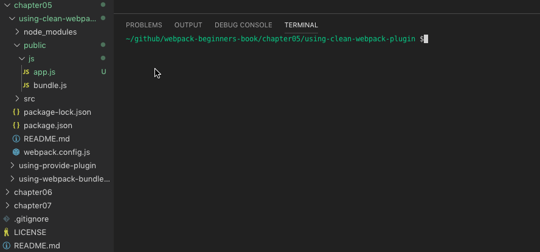

# clean-webpack-plugin

clean-webpack-plugin を利用して指定したディレクトリ内のファイルをを削除するサンプルコード

## 動作環境

- Node.js: v10.16.3
- npm: v6.9.0

## 使い方

このディレクトリ上で以下のコマンドを実行してください。

```
npm install
```

今回、ファイルが削除されるか確認するために、`public/js`ディレクトリに`app.js`という空のファイルを追加してみてください。

その後、次のコマンドで webpack を実行します。

```
npm run build
```

`public/js`ディレクトリ内のファイルが削除されたから、ファイルが出力されるため、`public/js`ディレクトリ内のファイルは`bundle.js`だけになります。


