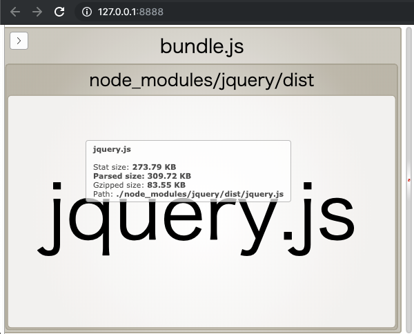

# webpack-bundle-analyzer

webpack-bundle-analyzer を利用してバンドルに含まれているモジュールや、それぞれのモジュールのファイルサイズを出力するサンプルコード。

## 動作環境

- Node.js: v10.16.3
- npm: v6.9.0

## 使い方

このディレクトリ上で以下のコマンドを実行してください。

```
npm install
```

次のコマンドを実行すれば、webpack が実行されて webpack-bundle-analyzer が立ち上がります。

```
npm run build
```

その後、ブラウザで http://127.0.0.1:8888 にアクセスすれば、バンドルの内容を確認できます。


