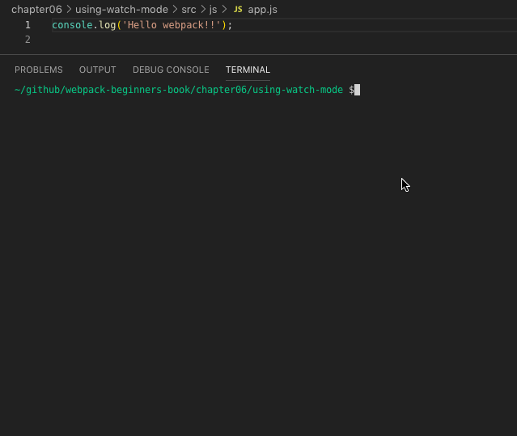

# watch モード

watch モードを有効にし、ファイルの変更を検知して再ビルドするサンプルコード。

## 動作環境

- Node.js: v10.16.3
- npm: v6.9.0

## 使い方

このディレクトリ上で以下のコマンドを実行してください。

```
npm install
```

その後、以下のコマンドを実行すれば、webpack が実行されてバンドルされたファイルが出力されます。

```
npm run build
```

watch モードが有効なため、`app.js`を更新する度に再ビルドされます。


