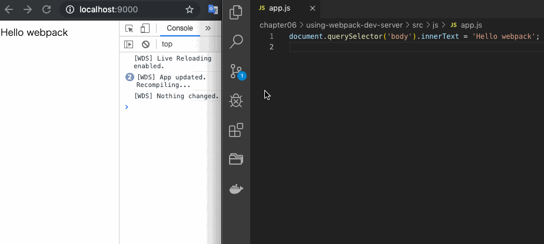

# 開発用サーバー

開発用サーバーである webpack-dev-server のライブリロード機能を利用したサンプルコード。

## 動作環境

- Node.js: v10.16.3
- npm: v6.9.0

## 使い方

このディレクトリ上で以下のコマンドを実行してください。

```
npm install
```

その後、以下のコマンドを実行すれば、サーバーが起動してブラウザで`public/index.html`が開かれます。

```
npm run start
```

ファイルが変更されたらブラウザがリロードされますので、`app.js`を更新すればリロードされます。


